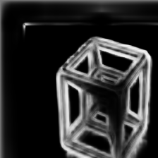

# HEDetector: Holistically-Nested Edge Detection

Holistically-nested edge detection (HED) is a deep learning model that uses fully convolutional neural networks and deeply-supervised nets to do image-to-image prediction. This project uses a pre-trained deep learning model implemented in Caffe to perform edge detection on input images and displays the results side by side.

## Features

- **HED Edge Detection**: Employs a pre-trained HED model to detect edges in images.
- **Image Resizing**: Resizes both the input image and the HED output to a fixed size of 224x224 pixels.
- **Side-by-Side Comparison**: Displays the original image and the edge-detected image side by side for easy comparison.

## Installation

Download the pre-trained HED model:
    - **deploy.prototxt**: [Download Link](https://github.com/ashukid/hed-edge-detector/blob/master/deploy.prototxt)
    - **hed_pretrained_bsds.caffemodel**: [Download Link](https://github.com/ashukid/hed-edge-detector/blob/master/hed_pretrained_bsds.caffemodel)

## Code Overview

The main script performs the following steps:

1. **Load Image**: Reads the input image from the file system.
2. **Preprocess Image**: Resizes the image to the target size (224x224) and creates a blob for the neural network.
3. **Load HED Model**: Loads the pre-trained HED model using Caffe.
4. **Edge Detection**: Performs a forward pass through the network to compute the edge detection result.
5. **Post-process Output**: Resizes the HED output to the same size as the input image and converts it to a displayable format.
6. **Display Results**: Concatenates the original image and the HED output side by side and displays them.

## Example Output

Below is an example of the side-by-side comparison of the input image and the HED edge detection output:

## Acknowledgments

- This project uses the Holistically-Nested Edge Detection (HED) model developed by Saining Xie and Zhuowen Tu.
- Special thanks to the OpenCV and Caffe communities for their amazing tools and resources.

